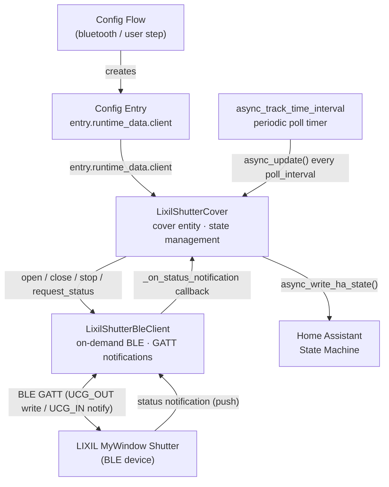

# Architecture Overview

This document describes the technical architecture of the Lixil Bluetooth Shutter custom component for Home Assistant.

## Directory Structure

```text
custom_components/lixil_shutter/
├── __init__.py              # Integration setup, BLE callback registration, platform setup
├── config_flow.py           # Config flow entry point (delegates to config_flow_handler/)
├── const.py                 # Constants: BLE UUIDs, commands, status codes, product types
├── data.py                  # LixilShutterData dataclass and LixilShutterConfigEntry type alias
├── diagnostics.py           # Diagnostic data (BLE status, device/entity registry info)
├── manifest.json            # Integration metadata, BLE SERVICE_UUID for discovery
├── repairs.py               # Repair flow templates
├── services.yaml            # Service action definitions (currently empty — no custom services)
├── api/                     # BLE GATT client
│   ├── __init__.py          # Exports LixilShutterBleClient, exceptions
│   ├── _bluez.py            # BlueZ D-Bus pairing helper (local adapter only)
│   ├── client.py            # LixilShutterBleClient (on-demand BLE connection, GATT notifications)
│   └── exceptions.py        # LixilShutterBleClientError, LixilShutterBleClientCommunicationError
├── config_flow_handler/     # Config flow implementation
│   ├── __init__.py          # Package exports
│   ├── config_flow.py       # bluetooth + user + confirm + pair steps
│   ├── options_flow.py      # Options flow (poll interval, command monitor window)
│   └── schemas/             # Voluptuous schemas for options form
├── cover/                   # Cover platform
│   ├── __init__.py          # async_setup_entry() — registers LixilShutterCover
│   └── shutter.py           # LixilShutterCover entity
├── service_actions/         # Service action handlers (currently empty)
│   └── __init__.py
└── translations/            # Localization files
    ├── en.json
    └── ja.json
```

## Core Components

### BLE Client

**File:** `api/client.py`

`LixilShutterBleClient` manages the full BLE lifecycle for one shutter:

- **On-demand connection**: Connects only when a command or status poll is issued. No permanently held BLE link.
- **Idle-disconnect timer**: After each command or poll, the client schedules automatic disconnection (`_IDLE_DISCONNECT_SEC` or caller-supplied `idle_after`). This frees the BLE link for other clients (e.g., physical remote).
- **GATT notifications**: Status updates pushed by the device via the UCG_IN characteristic are delivered to a registered callback without requiring polling.
- **Command encoding**: All BLE byte-level details are encapsulated here. Callers use semantic methods (`open()`, `close()`, `stop()`, `open_flap_slats()`, `request_status()`).
- **Bluetooth Proxy support**: Detects ESPHome/ESP32 Bluetooth Proxy via `BLEDevice.details`; skips D-Bus operations and delegates BLE-level bonding to the proxy.

**BLE pairing**: For local BlueZ adapters, pairing is handled by `api/_bluez.py` via BlueZ D-Bus `Pair()`. For Bluetooth Proxy devices, pairing is handled by the ESP32 chip through bleak.

### Cover Entity

**File:** `cover/shutter.py`

`LixilShutterCover` is the single `cover` entity created per configured shutter:

- Holds an `LixilShutterBleClient` instance (shared via `entry.runtime_data.client`)
- Registers a GATT notification callback on `async_added_to_hass`
- Schedules a periodic status-poll timer using `async_track_time_interval`
- Cleans up the BLE connection on `async_will_remove_from_hass`
- Updates state optimistically on commands; confirmed via GATT notification
- `_attr_assumed_state = True`: both open and close buttons are always shown regardless of state, because the shutter reports only `STATUS_OPEN` / `STATUS_CLOSED` and cannot report partial positions

> **Device limitation:** The shutter reports `STATUS_OPEN` for every non-fully-closed position (fully open, halfway, stopped mid-travel).  As a result, `STATUS_OPEN` is mapped to `None` (unknown state) in all cases except after the OPENING motion window expires naturally.  `CoverState.OPEN` (fully open) is only applied when the open command has been running uninterrupted for at least `command_monitor` seconds without a stop command being issued.  It is not possible to distinguish "fully open" from "partially open" via BLE notifications alone.

**Motion window** (`CONF_COMMAND_MONITOR`):

When an open or close command is issued, the entity sets the state to `opening` / `closing` and starts the motion window *before* sending the BLE command.  This ensures that any `STATUS_OPEN` GATT notifications arriving during the BLE round-trip (~1–2 s) are already suppressed.  The window runs for `command_monitor` seconds; a definitive `STATUS_CLOSED` / `STATUS_VENTILATION` notification cancels it early.  If the BLE command fails the window is cancelled immediately.  On stop, state is set to `None` (unknown/partial position) immediately and no window is started.  After the OPENING window expires naturally, the next `STATUS_OPEN` notification is treated as fully open (`CoverState.OPEN`); in all other cases `STATUS_OPEN` maps to `None`.  See [DECISIONS.md](./DECISIONS.md) for background.

**Supported features:**

| Feature | All models | Ventilation models |
| ------- | ---------- | ------------------ |
| OPEN | ✅ | ✅ |
| CLOSE | ✅ | ✅ |
| STOP | ✅ | ✅ |
| OPEN_TILT | — | ✅ |
| CLOSE_TILT | — | ✅ |

Ventilation models: types 2–7 (ShutterItalia, Sunshade, Skylight, Screen, ACAdapter, InHouseGarage).

### Config Flow

**Directory:** `config_flow_handler/`

Supports two registration paths:

1. **Bluetooth discovery** (`async_step_bluetooth`): Triggered by HA when a device advertising the integration's `SERVICE_UUID` is detected. Only proceeds when the device is in pairing mode (`PAIRING_MODE_BIT` set in manufacturer data).
2. **Manual setup** (`async_step_user`): User opens "Add Integration". Shows a selector of discovered devices in pairing mode. Aborts with `no_devices_found` if none are detected.

Both paths converge at:

- `async_step_confirm` — Shows device name, address, product type; user confirms
- `async_step_pair` — Executes BLE pairing; retries on failure

**Options flow** (`options_flow.py`): Single-step form with:

- **Poll interval** (`CONF_POLL_INTERVAL`): BLE status-poll frequency in seconds
- **Command monitor window** (`CONF_COMMAND_MONITOR`): How long the entity shows `opening` / `closing` after a command, and how long the BLE connection is held open after a command. Should be set to the shutter's approximate full-travel time.

## Data Flow

No coordinator is used. The cover entity communicates with the BLE client directly:



State update triggers:

1. **GATT notification** (push): Device pushes status after any command → `_on_status_notification` callback → immediate state update
2. **Periodic poll** (pull): `async_track_time_interval` timer fires → `async_update()` → sends STATUS_REQUEST over BLE → device responds via notification

## Key Design Decisions

See [DECISIONS.md](./DECISIONS.md) for architectural and design decisions made during development.

## Extension Points

### Adding a New Platform

1. Create directory: `custom_components/lixil_shutter/<platform>/`
2. Implement `__init__.py` with `async_setup_entry()`
3. Create entity classes
4. Add platform to `PLATFORMS` list in `__init__.py`

### Adding a Service Action

1. Create service action handler in `service_actions/<service_name>.py`
2. Define service action in `services.yaml` with schema
3. Register service action in `__init__.py:async_setup()` (NOT `async_setup_entry`)

## Testing Strategy

- **Unit tests:** Test individual functions and classes in isolation
- **BLE client tests:** Use `bleak` mock fixtures to simulate GATT operations
- **Config flow tests:** Test each step (bluetooth, user, confirm, pair) with `hass` fixture
- **Fixtures:** Shared test fixtures in `tests/conftest.py`

Tests mirror the source structure under `tests/`.

## Dependencies

Core dependencies (see `manifest.json`):

- `homeassistant.components.bluetooth` — BLE scanner integration
- `bleak` / `bleak-retry-connector` — Underlying BLE library (bundled with HA)
- `dbus-fast` — BlueZ D-Bus pairing for local adapters (transitive HA dependency)

Development dependencies: see `requirements_dev.txt` and `requirements_test.txt`.

